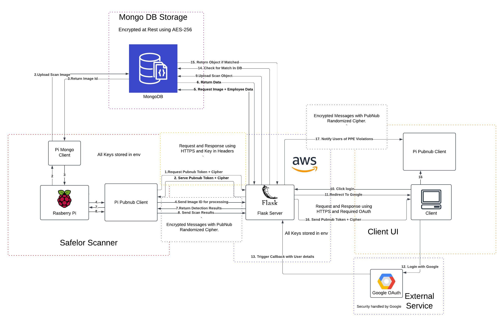

<div align="center">
    <a href="https://git.io/typing-svg"></a>
</div>

<div align="center">
  
</div> 

## 📜 Overview

**Safelor** is an innovative IoT solution designed to ensure worker compliance with Personal Protective Equipment (PPE) requirements in high-risk zones. By combining smart hardware, computer vision, and advanced reporting capabilities, Safelor automates safety checks, reduces risks, and enhances operational efficiency.

### Key Features
- **Automated PPE Verification:** Real-time validation of helmets, vests, and RFID-enabled boots.
- **Seamless Worker Interaction:** Traffic light signals and voice prompts guide workers through the process.
- **Comprehensive Reporting:** Historical compliance logs accessible to supervisors through an intuitive interface.
- **IoT Integration:** Easily add new scanning features and monitor multiple rooms with several Raspberry Pi devices.

---

## 🚀 Getting Started

### Prerequisites

To set up the Safelor system, you will need:

1. **Hardware:**
   - Raspberry Pi (Model Zero 2W or equivalent).
   - Camera module (e.g., Raspberry Pi Camera Module V2).
   - RFID reader and compatible tags.
   - **2 PIR motion sensors** (e.g., HC-SR501).
   - LED Traffic Light Module.
   - Speaker (e.g., CQRobot Speaker).

2. **Software:**
   - Python 3.x environment.
   - Flask framework.
   - MongoDB database.
   - PubNub for real-time communication.

3. **Miscellaneous:**
   - Breadboards, resistors, and connectors.
   - Stable internet connection for real-time data transmission.

### Installation

**Clone the repository:**
```bash
$ git clone https://github.com/seanMooney1996/Safelor.git
$ cd Safelor
```

**Setup SafelorApp:**
```bash
$ cd SafelorApp
$ pip install -r requirements.txt
$ touch .env
```
Update the `.env` file with the following keys:
```env
PUBLISH_PUBNUB_KEY=
SUBSCRIBE_PUBNUB_KEY=
SECRET_PUBNUB_KEY=
PUBNUB_USERID=
PUBNUB_CYPHER_KEY=

MONGODB_USER=
MONGODB_PASS=

GOOGLE_CLIENT_ID=
GOOGLE_CLIENT_SECRET=
SECRET_FLASK_KEY=

SECRET_API_KEY=
```

**Add Google Authentication Configuration:**
To enable Google login, create a `google_auth_secrets.json` file and place it in the `SafelorApp` directory. Follow these steps to generate the file:

1. Go to the [Google Cloud Console](https://console.cloud.google.com/).
2. Create a new project or select an existing one.
3. Navigate to **APIs & Services** > **Credentials**.
4. Click **Create Credentials** > **OAuth 2.0 Client ID**.
5. Configure the consent screen with necessary details.
6. Set the application type to **Web application**.
7. Add the following URIs:
   - **Authorized redirect URI:** `http://localhost:5000/oauth2callback`
8. Download the generated JSON file and rename it to `google_auth_secrets.json`.
9. Place this file in the `SafelorApp` folder.

**Setup SafelorPi:**
```bash
$ cd SafelorPi
$ pip install -r requirements.txt
$ touch .env
```
Update the `.env` file with the following keys:
```env
PUBLISH_PUBNUB_KEY=
SUBSCRIBE_PUBNUB_KEY=
SECRET_PUBNUB_KEY=
PUBNUB_USERID=

MONGODB_USER=
MONGODB_PASS=

SECRET_FLASK_KEY=

SECRET_API_KEY=
```

**Run the applications:**
- For SafelorApp:
```bash
$ python app.py
```
- For SafelorPi:
```bash
$ python app.py
```

---

## 🛠 System Architecture


### Workflow
1. **Activation:** PIR sensors detect motion, waking up the system.
2. **Visual Analysis:** The camera captures an image, and the system analyzes PPE compliance.
3. **Interaction:** Workers receive audio and visual feedback to proceed or correct their equipment.
4. **Verification:** RFID tags are scanned for further validation.
5. **Decision:** Results are logged and sent to supervisors via PubNub.

---

## 📊 Features and Benefits

| Feature                         | Description                                      | Benefit                                |
|---------------------------------|--------------------------------------------------|----------------------------------------|
| Real-Time PPE Compliance Check | Validates helmets, vests, and RFID-enabled boots.| Ensures safety and reduces violations. |
| Traffic Light Guidance          | Visual signals for worker compliance status.     | Simplifies the safety check process.   |
| Voice Prompts                   | Audio instructions for workers.                 | Minimizes confusion and delays.        |
| Historical Logs                 | Tracks all checks and violations.               | Supports compliance audits.            |

---

## 🖼 Demo

[Videos](https://mahara.dkit.ie/view/view.php?id=133981)

---

## 🔧 Development

### Folder Structure
```
Safelor/
├── SafelorApp/          # Server-side application
│   ├── app.py          # Main application logic for server
│   ├── mongodb/        # MongoDB interaction logic
│   ├── pubnub/         # PubNub configuration and handlers
│   ├── static/         # Static files (CSS, images, etc.)
│   ├── templates/      # HTML templates
│
├── SafelorPi/           # Raspberry Pi application
│   ├── sensors/        # Sensor modules (camera, PIR, RFID, traffic light, speaker)
│   ├── app.py          # Main application logic for Pi
│   ├── pubnub_Pi/      # PubNub interaction for Pi
│   ├── scan_images/    # Temporary storage for scanned images
│
└── README.md            # Project documentation
```

### How to Contribute
1. Fork the repository.
2. Create a new branch for your feature: `git checkout -b feature-name`.
3. Commit changes: `git commit -m "Add feature description"`.
4. Push to your branch: `git push origin feature-name`.
5. Submit a pull request for review.

---

## 💡 Future Enhancements
- **Expanded IoT Integration:** Further support for new equipment scanning and enhanced compatibility across multiple facilities.
- **Advanced Reporting:** Dashboard analytics for compliance trends and predictive safety measures.

---

**Safelor: Building Safer Workplaces.**
